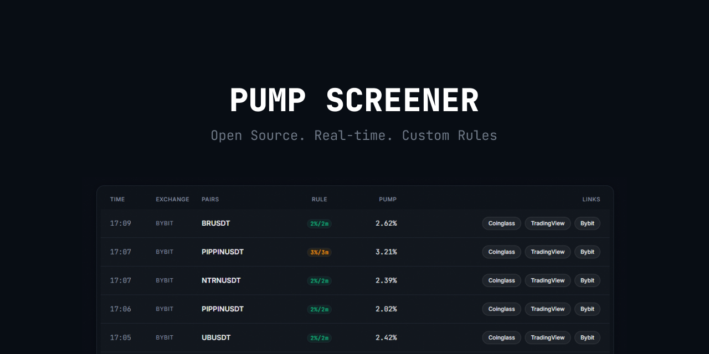

<div align="center">



[](LICENSE.txt)
[](https://github.com/foxclerec/bybit-pump-screener-light/actions/workflows/build.yml)
[](#download)

</div>

---

[Download](#download) &nbsp;&bull;&nbsp; [Features](#features) &nbsp;&bull;&nbsp; [Quick Start](#quick-start) &nbsp;&bull;&nbsp; [Contributing](CONTRIBUTING.md)

---

## Download

**The easiest way** — grab the latest release:

| Platform | Link |
|----------|------|
| Windows | [**PumpScreener-Windows.zip**](https://github.com/foxclerec/bybit-pump-screener-light/releases/latest) |
| macOS | [PumpScreener-macOS.zip](https://github.com/foxclerec/bybit-pump-screener-light/releases/latest) |
| Linux | [PumpScreener-Linux.zip](https://github.com/foxclerec/bybit-pump-screener-light/releases/latest) |

> **Requirements:** Windows 10+ / macOS 12+ / Ubuntu 22+. ~200 MB RAM. No installation, no Python, no API keys.

Unzip. Run `PumpScreener`. Done.

---

## Features

- **Real-time pump detection** — monitors all Bybit USDT perpetual pairs via WebSocket, REST fallback if connection drops
- **Sound alerts** — hear it the moment a pump fires, pick from built-in sounds or mute anytime
- **Custom detection rules** — set your own thresholds, lookback windows, and colors per rule
- **Desktop GUI** — native window, no browser needed, minimize to system tray
- **Smart filtering** — filter by 24h volume, symbol age, watchlist, blacklist — all configurable in the UI
- **Per-rule dedup** — same pair + rule won't spam you, configurable cooldown period
- **Live signals table** — sortable, paginated, with direct links to TradingView and Coinglass
- **Auto-update check** — notifies you when a new version is available
- **Zero configuration** — works out of the box, all settings adjustable through the GUI
- **Open source** — MIT licensed, no telemetry, no accounts, no API keys

---

## Why Pump Screener Light?

Every other crypto pump detector is either a CLI script, a paid web service, or abandoned. This is the only open-source pump screener that gives you all three:

| | Pump Screener Light | CLI scripts | Paid services |
|---|:---:|:---:|:---:|
| Desktop GUI | **Yes** | No | Browser only |
| Sound alerts | **Yes** | No | Some |
| Unlimited custom rules | **Yes** | Hardcoded | Limited / paywalled |
| No Telegram subscriptions | **Yes** | Telegram-dependent | Often required |
| Free & open-source | **Yes** | Yes | No |
| No API keys needed | **Yes** | Varies | No |
| Works offline (no account) | **Yes** | Yes | No |
| Windows/macOS/Linux exe | **Yes** | No | N/A |

---

## How It Works

Pump Screener connects to Bybit via WebSocket and receives real-time price data for 500+ USDT perpetual trading pairs. Every few seconds, it checks each pair against your detection rules — if the price moved up by X% over the last N minutes, a signal fires. You hear a sound, see the signal in the table, and can click through to TradingView or Coinglass for a deeper look.

All detection rules, filters, and preferences are stored locally in a SQLite database. No data leaves your machine.

---

<!-- TODO: add screenshots
## Screenshots

| Signals Table | Settings |
|:---:|:---:|
|  |  |

---
-->

## Quick Start

### Option 1: Download the exe (recommended)

1. Download the latest release for your OS from the [Releases page](https://github.com/foxclerec/bybit-pump-screener-light/releases/latest)
2. Unzip the archive
3. Run `PumpScreener` (or `PumpScreener.exe` on Windows)

The app opens a native window with the signals table. The screener starts automatically.

### Option 2: Run from source (for developers)

```bash
git clone https://github.com/foxclerec/bybit-pump-screener-light.git
cd bybit-pump-screener-light

pip install -r requirements.txt

# Create a .env file with a secret key
echo "SECRET_KEY=$(python -c 'import secrets; print(secrets.token_hex(32))')" > .env

# Initialize the database
flask --app app:create_app init-db

# Start the screener (in a separate terminal)
flask --app app:create_app screener-run

# Start the web server (in another terminal)
flask --app app:create_app run
```

Open `http://127.0.0.1:5000` in your browser.

---

## Configuration

All settings are accessible through the **Settings** page in the app — no config files to edit.

- **Rules** — add, edit, or remove detection rules (threshold %, lookback period, color)
- **Filters** — minimum volume, minimum symbol age, watchlist, blacklist
- **Notifications** — alert sound selection, cooldown, dedup hold period
- **Display** — timezone, rows per page, link visibility

Changes apply immediately, no restart needed.

---

## Disclaimer

This software is for **informational purposes only**. It is not financial advice. Cryptocurrency trading carries significant risk of loss. The authors are not responsible for any trading decisions or financial losses. Use at your own risk.

---

## Contributing

This is an early release, and like any v1 — bugs happen. Even Windows ships patches every month. If you spot an issue or have an idea, jump in — every report and PR makes the app better for everyone.

- Found a bug? [Open an issue](https://github.com/foxclerec/bybit-pump-screener-light/issues/new?template=bug_report.md)
- Have an idea? [Request a feature](https://github.com/foxclerec/bybit-pump-screener-light/issues/new?template=feature_request.md)
- Want to contribute code? See [CONTRIBUTING.md](CONTRIBUTING.md) for dev setup and guidelines

---

## Support the Project

If you find this useful, consider supporting the project:

- [Ko-fi](https://ko-fi.com/pump_screener)
- [Crypto donation](https://nowpayments.io/donation/pump_screener)
- Trade on [Bybit](https://www.bybit.com/invite?ref=D5YARGK) using my referral link

---

## License

[MIT](LICENSE.txt) &copy; 2025-2026 foxclerec
